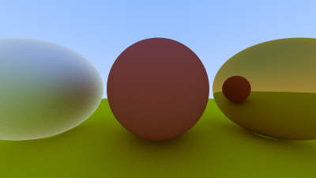
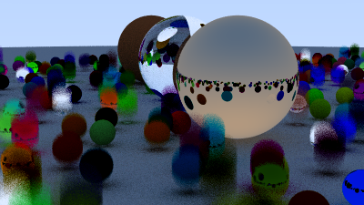

# Ray tracing in one weekend
A project implementation follow [Ray tracing in one weekend](https://raytracing.github.io/books/RayTracingInOneWeekend.html) tutorial.

Run using
```c
g++ main.cpp -o main; ./main
```

The out put will be named image.ppm you need extension to view it.

## The results
<br>
A simple raytracing result.<br>
<br>
A more complicate one.
